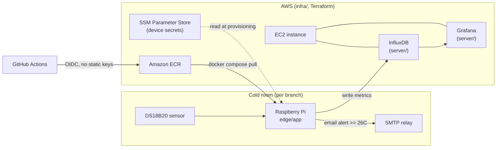

# IoT Cold-Chain Monitor

<p align="center">
    
</p>


A small production IoT system, rebuilt as a DevSecOps portfolio piece: Raspberry Pi
devices with temperature sensors installed in refrigerated rooms across several
retail branches, streaming readings to a Grafana dashboard and firing an email
alert whenever a room crosses 26°C.

This repo is a from-scratch, sanitized rework of two private repos that ran this
system in production. It keeps the original architecture and logic, and adds the
DevSecOps layer that was missing: Infrastructure as Code, containerization
hardening, CI/CD, and automated security scanning. See [SECURITY.md](SECURITY.md)
for the specific vulnerabilities found in the original setup and how each is
fixed here.

## Architecture



- **`edge/bootstrap/`** - bash scripts that provision a fresh Raspberry Pi: hostname,
  Wi-Fi, Docker, Tailscale, a network watchdog, and the app itself. Ported from
  the original `thermalRasp-Setup` repo.
- **`edge/app/`** - the Python service that reads the sensor, writes to InfluxDB,
  drives a small LCD status display, and sends the threshold email alert. Ported
  from the original `monitor-clima-iot` repo.
- **`server/`** - the Grafana + InfluxDB stack that runs on the EC2 host, as code
  (this never existed as code before - it was configured by hand).
- **`infra/`** - Terraform for the EC2 instance, networking, IAM (including
  GitHub OIDC roles), and the SSM parameters that hold device secrets.
- **`.github/workflows/`** - CI: app lint/build, Terraform plan, a multi-tool
  security scan (Trivy, Checkov, Bandit, ShellCheck, gitleaks), and the ECR
  release pipeline.

## Why EC2 + Docker Compose, not Kubernetes

The server side is one Grafana instance and one InfluxDB instance serving a
handful of edge devices. That's a single-box workload - Terraform-managed EC2 +
Compose gets the same reliability and reproducibility as Kubernetes here without
the operational overhead of running a cluster for two containers.

## Local development

```bash
# Edge app (needs real Pi hardware for the sensor/LCD, but lints/builds anywhere)
cd edge/app
cp .env.example .env   # fill in local/dev values
docker compose config  # validate compose file

# Server stack (can run anywhere, e.g. a dev laptop, to preview dashboards)
cd server
cp .env.example .env
docker compose up -d
# Grafana at http://localhost:3000, InfluxDB at http://localhost:8086

# Infra
cd infra/envs/prod
cat README.md           # one-time bootstrap steps (state bucket, key pair)
terraform init
terraform plan
```

## Security scanning

Run locally before pushing:

```bash
trivy fs .
checkov -d infra
shellcheck edge/bootstrap/*.sh edge/app/dupdate.sh
bandit -r edge/app/src edge/app/examples
```

The same checks run in CI on every PR (`.github/workflows/security-scan.yml`).
